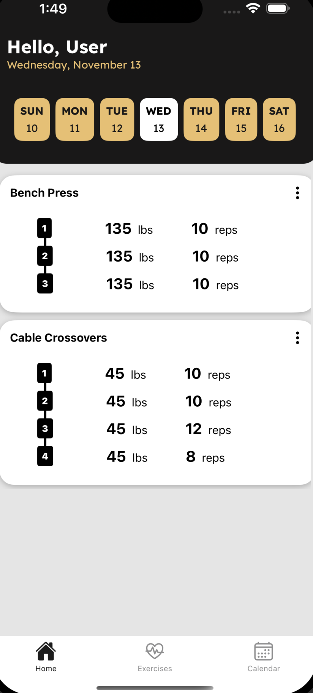
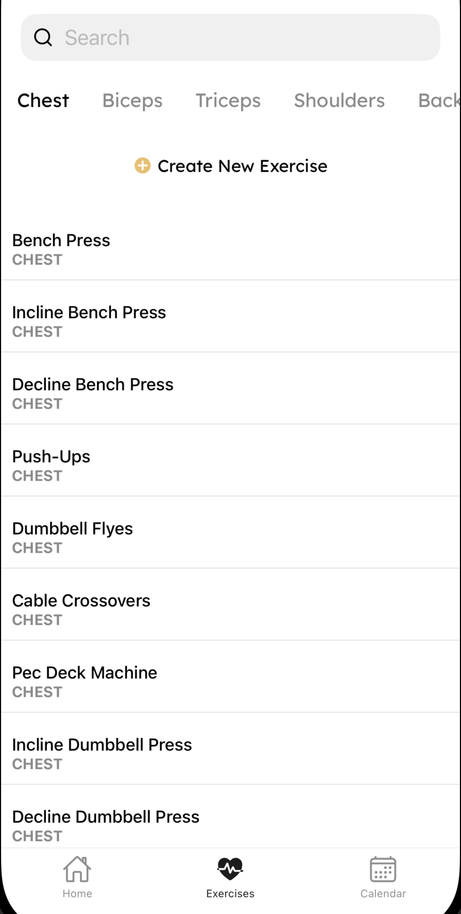
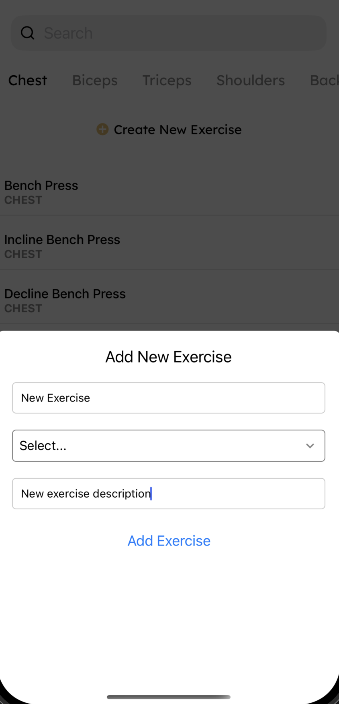
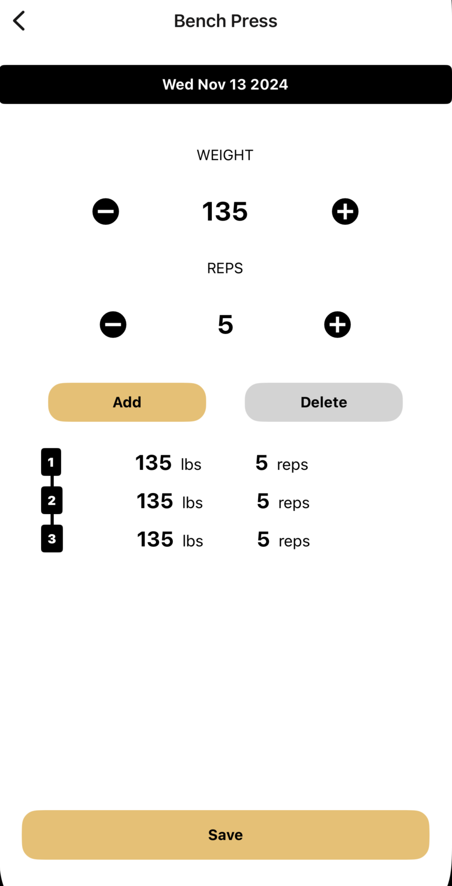
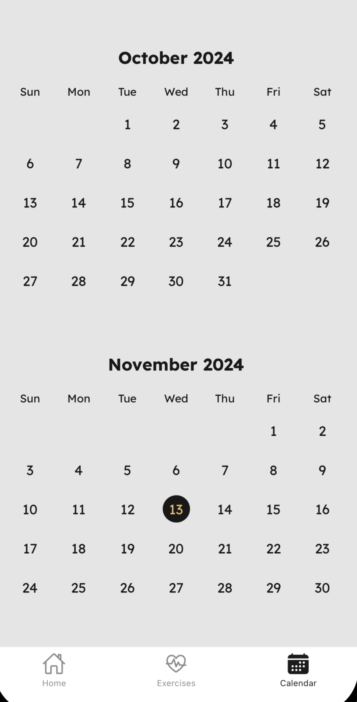
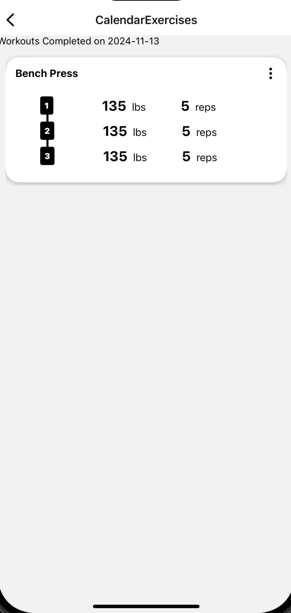

# Workout Tracker iOS application

Workout Tracker is a simple way to keep track of your workouts.

## Users are able to:

- Select from the pre-loaded workouts, or add their own
- Add weight/reps per set for the exercise as they complete the workout
- Save the exercise to the database and view all workouts for that day
- View previous days of the week to see what exercises were completed
- Delete workouts
- Calendar page to view workouts several months/years in the past

## More features coming soon such as:
- Change to kgs
- Edit workouts from the home screen
- Create routines 
- Minor UI tweaks, bug fixes, and other enhancements 

## Images

<p float="left">
  
  
  
  
  
  
</p>

## Run Application

1. Install dependencies

   ```bash
   npm install
   ```

2. Start the app

   ```bash
    npm run ios
   ```


